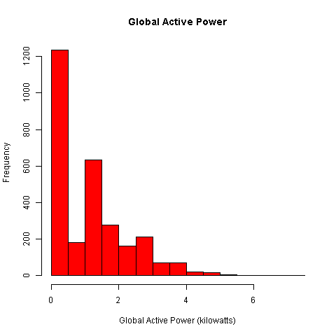

# Coursera JHU DS Exploratory Data Analysis Course Project No. 1

This document is developed just to represent the results of the course project.

## Created PNG Files


### Plot 1


 


### Plot 2

 


### Plot 3

 


### Plot 4

 

## The four scripts submitted to review

### plot1.R script

```{r echo=FALSE}
read_chunk('plot1.R')
```
